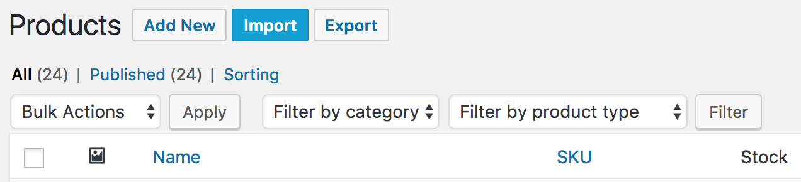
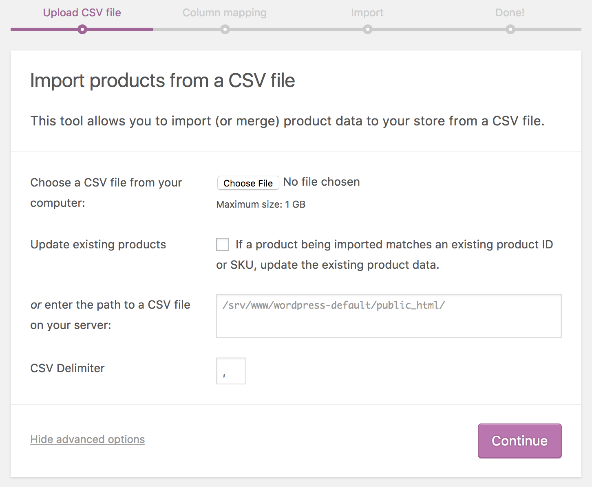
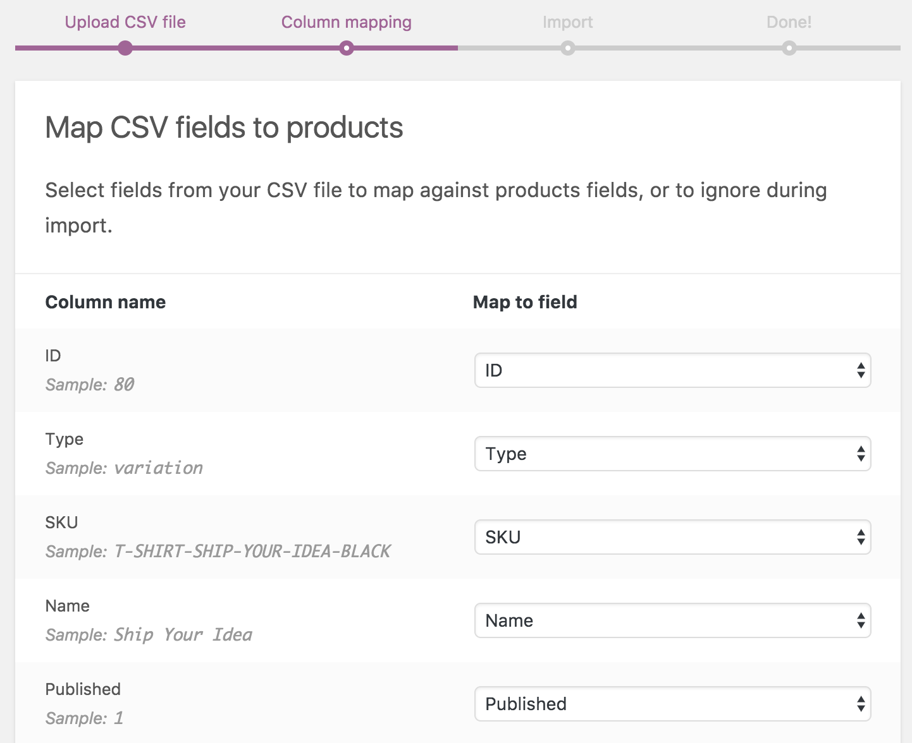
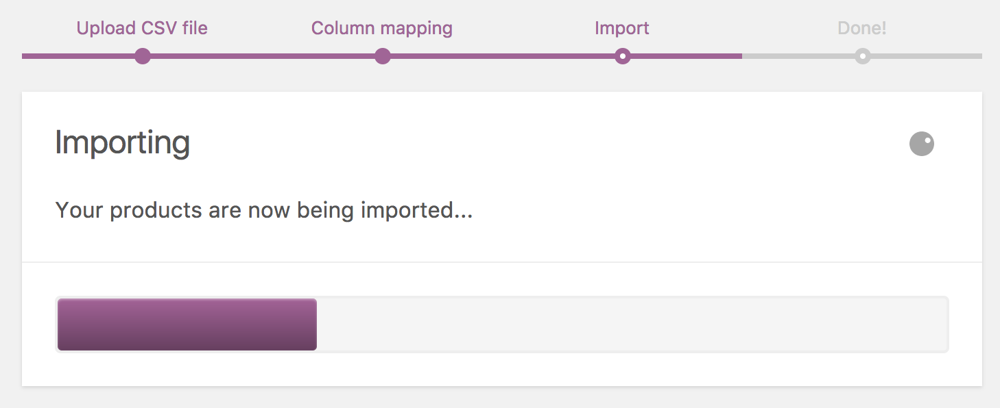
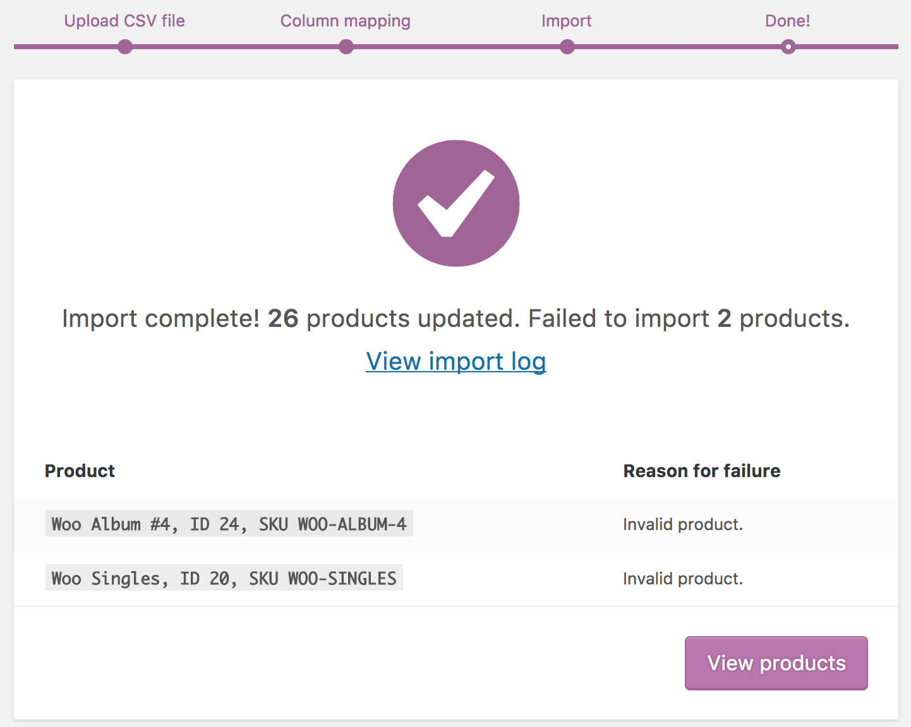
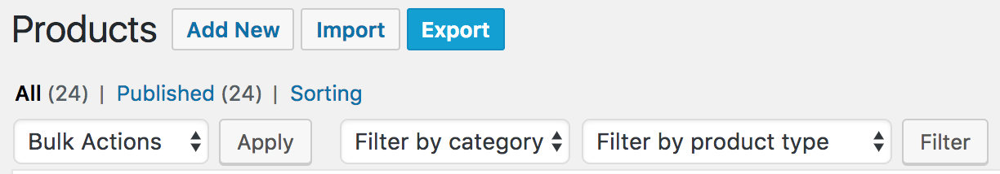
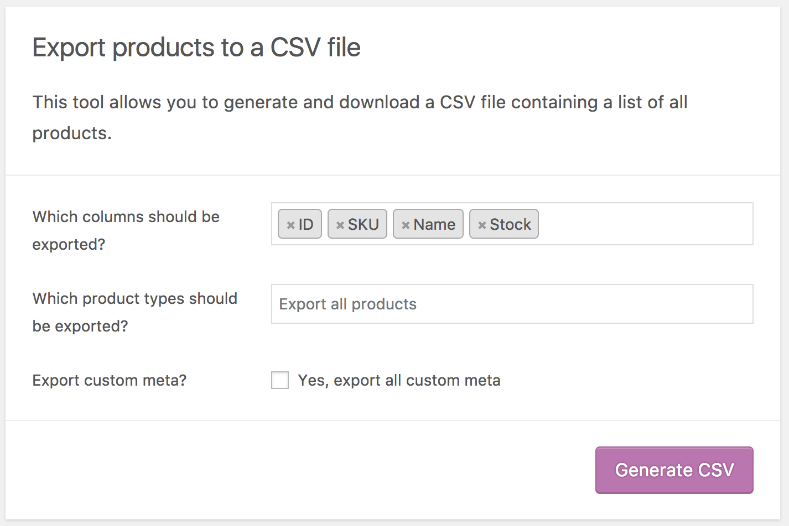

<!-- START doctoc generated TOC please keep comment here to allow auto update -->
<!-- DON'T EDIT THIS SECTION, INSTEAD RE-RUN doctoc TO UPDATE -->
## Table of Contents

- [Overview](#overview)
- [Importer](#importer)
  - [Upload CSV File Screen](#upload-csv-file-screen)
  - [Mapping Screen](#mapping-screen)
  - [Importing screen](#importing-screen)
  - [Adding Custom Import Columns (Developers)](#adding-custom-import-columns-developers)
- [Exporter](#exporter)
  - [Adding Custom Export Columns (Developers)](#adding-custom-export-columns-developers)
- [Support & Bugs](#support--bugs)

<!-- END doctoc generated TOC please keep comment here to allow auto update -->

## Overview

Starting in version 3.1.0, WooCommerce has a built-in product CSV importer and exporter. You can easily import, export, and update hundreds or thousands of products on your WooCommerce sites. The importer and exporter support all types of products, including variations. This guide will walk you through using the importer and exporter and will also detail how to add custom import and export columns for developers.

## Importer

You can access the importer on the main "Products" admin screen:



Click the button to begin the import process.

### Upload CSV File Screen



**File upload:** CSV files should match [the CSV importer schema](https://github.com/woocommerce/woocommerce/wiki/Product-CSV-Import-Schema). If you are creating the files by hand, be sure to follow the schema otherwise your products will not import properly. If you are using a file generated by the exporter, everything should already be good to go.

**Update existing products:** If you have IDs and/or SKUs in your CSV file, the importer can update your existing products that have the same IDs or SKUs with information from the CSV. Check this box if you want this behavior, otherwise the importer will skip CSV products that have the same ID or SKU as an existing product.

**CSV delimiter:** (Advanced option) Generally CSV elements are separated by a comma. If you are using a different delimiter in your file you can set it here.

### Mapping Screen



The mapping screen maps the columns from your CSV to known columns that can be imported. It will try to do this automatically where possible. On the left side of the screen are the column names read from the CSV and sample data read from the CSV. On the right side are mappings for each column. 

If there are any columns you do not wish to import, set the right site to "Do not import".

Unrecognized columns will be mapped as "Do not import" by default.

Column names prefixed with `meta:` will get automatically mapped as meta data to import. For example, if you have a column named `meta:product_depth` the values of that column will get imported and saved as meta data under the "product_depth" key.

When you are satisfied with the mapping, click the "Run the importer" button.

### Importing screen



The importer will process the CSV file asynchronously in batches. The progress meter will let you know the current status of the processing. Do not close the page while the importer is processing, otherwise you will not fully import your CSV file. 

When the importer is finished processing, you will see a summary. If there were products that were not imported, you can view a log listing each product that was not imported and the reason.



### Adding Custom Import Columns (Developers)

It is a straightforward process to add support for custom columns to the importer. The following example breaks down the process:

```php
/**
 * Register the 'Custom Column' column in the importer.
 *
 * @param array $options
 * @return array $options
 */
function add_column_to_importer( $options ) {

	// column slug => column name
	$options['custom_column'] = 'Custom Column';

	return $options;
}
add_filter( 'woocommerce_csv_product_import_mapping_options', 'add_column_to_importer' );

/**
 * Add automatic mapping support for 'Custom Column'. 
 * This will automatically select the correct mapping for columns named 'Custom Column' or 'custom column'.
 *
 * @param array $columns
 * @return array $columns
 */
function add_column_to_mapping_screen( $columns ) {
	
	// potential column name => column slug
	$columns['Custom Column'] = 'custom_column';
	$columns['custom column'] = 'custom_column';

	return $columns;
}
add_filter( 'woocommerce_csv_product_import_mapping_default_columns', 'add_column_to_mapping_screen' );

/**
 * Process the data read from the CSV file.
 * This just saves the value in meta data, but you can do anything you want here with the data.
 *
 * @param WC_Product $object - Product being imported or updated.
 * @param array $data - CSV data read for the product.
 * @return WC_Product $object
 */
function process_import( $object, $data ) {
	
	if ( ! empty( $data['custom_column'] ) ) {
		$object->update_meta_data( 'custom_column', $data['custom_column'] );
	}

	return $object;
}
add_filter( 'woocommerce_product_import_pre_insert_product_object', 'process_import', 10, 2 );
```

## Exporter

You can access the exporter on the main "Products" admin screen:



Click the button to begin the exporting process.



**Columns:** If you do not want to export every column of product information, you can choose which columns to export here. By default, all product information except meta data will be exported.

**Product types:** If you only want to export products of a certain type, you can choose which product types will be exported here. By default, products of all types will be exported.

**Export custom meta:** If you have meta data on your products from other plugins and you want to export it, check this box. Meta data columns will be exported following the `meta:`-prefix standard detailed above in the importer mapping section. By default, no additional meta data will be exported.

When you are satisfied with the exporter settings, click the "Generate CSV" button. You can view the status of the exporter in the progress bar. Do not close the screen while the exporter is exporting, otherwise you will be missing information in the generated CSV file.

### Adding Custom Export Columns (Developers)

It is a straightforward process to add support for custom columns to the exporter. The following example breaks down the process:

```php
/**
 * Add the custom column to the exporter and the exporter column menu.
 *
 * @param array $columns
 * @return array $columns
 */
function add_export_column( $columns ) {

	// column slug => column name
	$columns['custom_column'] = 'Custom Column';

	return $columns;
}
add_filter( 'woocommerce_product_export_column_names', 'add_export_column' );
add_filter( 'woocommerce_product_export_product_default_columns', 'add_export_column' );

/**
 * Provide the data to be exported for one item in the column.
 *
 * @param mixed $value (default: '')
 * @param WC_Product $product
 * @return mixed $value - Should be in a format that can be output into a text file (string, numeric, etc).
 */
function add_export_data( $value, $product ) {
	$value = $product->get_meta( 'custom_column', true, 'edit' );
	return $value;
}
// Filter you want to hook into will be: 'woocommerce_product_export_product_column_{$column_slug}'.
add_filter( 'woocommerce_product_export_product_column_custom_column', 'add_export_data', 10, 2 );
```

## Support & Bugs

If you are having difficulty using the importer or have questions, please use [the forums](https://wordpress.org/support/plugin/woocommerce).

If you discover a bug in the importer or exporter, please [file an issue](https://github.com/woocommerce/woocommerce/issues) and we will investigate. 


