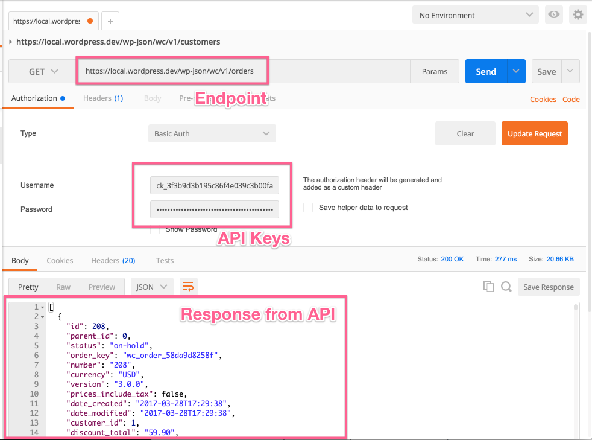
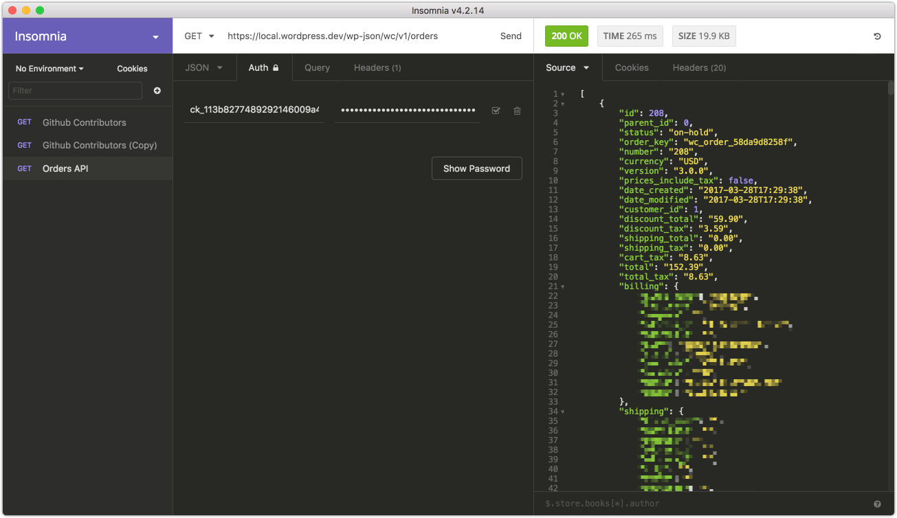
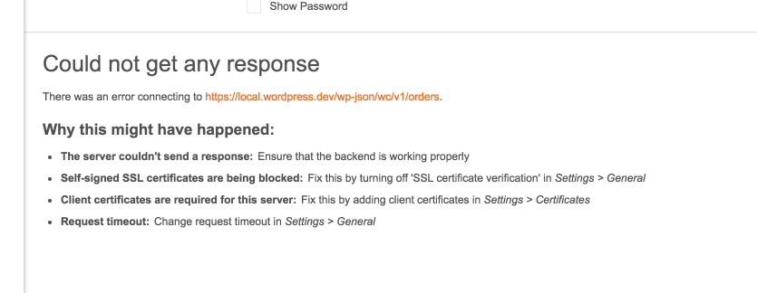
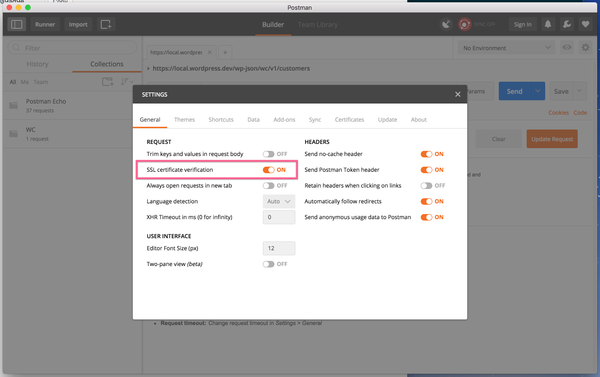
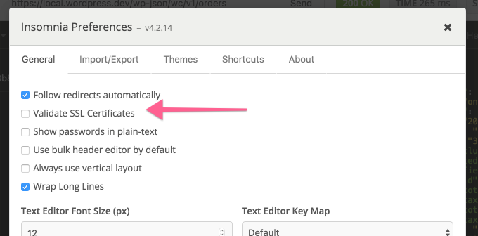

<!-- START doctoc generated TOC please keep comment here to allow auto update -->
<!-- DON'T EDIT THIS SECTION, INSTEAD RE-RUN doctoc TO UPDATE -->
## Table of Contents

- [Generate Keys](#generate-keys)
- [Making a basic request](#making-a-basic-request)
- [Common connection issues](#common-connection-issues)
  - [Connection issues with localhost and self signed SSL certificates](#connection-issues-with-localhost-and-self-signed-ssl-certificates)
  - [401 Unauthorized](#401-unauthorized)
  - [Consumer key is missing](#consumer-key-is-missing)

<!-- END doctoc generated TOC please keep comment here to allow auto update -->

The REST API is a powerful part of WooCommerce which lets you read and write various parts of WooCommerce data such as orders, products, coupons, customers, and shipping zones.

Authorization is usually the part most developers get stuck on so this guide will cover a quick way to test that your API is working on your server and you can auth. **If this works but your code to use the API does not, please bare in mind it will be a problem with your code. Please do not open issues asking for support about this on Github - use the support forums.**

We'll use both [Postman](https://www.getpostman.com/) and [Insomnia](https://insomnia.rest/) clients in these examples. Both are free and will help you visualise what the API offers.

Before proceeding, please read the [REST API docs on authentication which covers the important parts concerning API Keys and Auth](https://woocommerce.github.io/woocommerce-rest-api-docs/#authentication). We're only covering connecting over HTTPS here since it's the simplest and most secure method. You should avoid HTTP if possible.

## Generate Keys

First you need to generate some API keys and enable the REST API so you can start using it. 

1. Go to *WooCommerce > Settings > API* and ensure the API is enabled. 
2. Go to the *keys/apps* tab and click *add key*.
3. Give the key a description for your own reference, choose a user with access to orders etc, and give the key *read/write* permissions.
4. Click *generate api key*.
5. Your keys will be shown - do not close this tab yet, the secret will be hidden if you try to view the key again.


## Making a basic request

The request URL we'll test is `wp-json/wc/v1/orders`. On localhost the full URL may look something like this: `https://local.wordpress.dev/wp-json/wc/v1/orders`. Modify this to use your own site URL.

In Postman, you need to set the fields for request type, request URL, and the settings on the authorization tab. For Authorization, choose *basic auth* and enter your *consumer key* and *consumer secret* keys from WooCommerce into the username and password fields

Once done, hit send and you'll see the JSON response from the API if all worked well. You should see something like this:



Insomnia is almost identical to Postman; fill in the same fields and again use basic auth.



Thats it! The API is working.

If you have problems connnecting, you may need to disable SSL verification - see the connection issues section below.

## Common connection issues

### Connection issues with localhost and self signed SSL certificates

If you're having problems connecting to the REST API on your localhost and seeing errors like this:



You need to disable SSL verification. In Postman you can find this in the settings:



Insomnia also has this setting the preferences area:



### 401 Unauthorized

Your API keys or signature is wrong. Ensure that:

- The user you generated API keys for actually has access to those resources.
- The username when authenticating is your consumer key.
- The password when authenticating is your consumer secret.
- Make a new set of keys to be sure.

### Consumer key is missing

Occasionally servers may not parse the Authorization header correctly (if you see a “Consumer key is missing” error when authenticating over SSL, you have a server issue). 

In this case, you may provide the consumer key/secret as query string parameters instead. Example:

```
https://local.wordpress.dev/wp-json/wc/v1/orders?consumer_key=XXXX&consumer_secret=XXXX
```